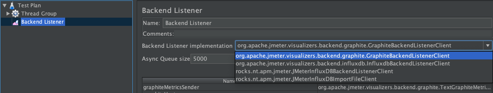
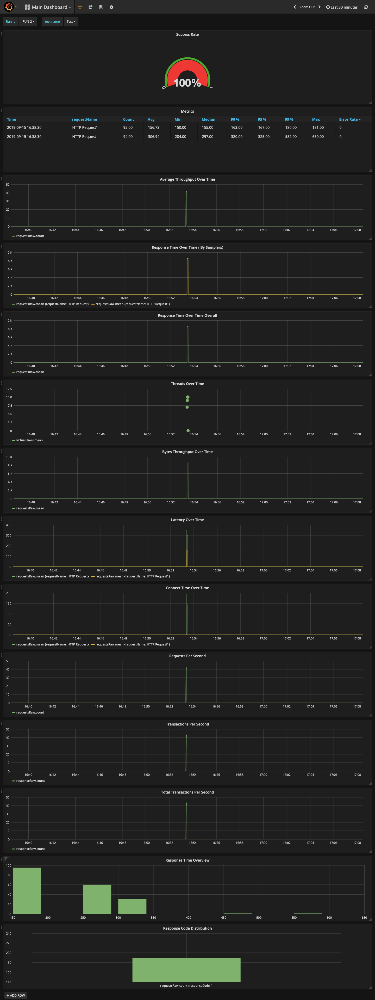
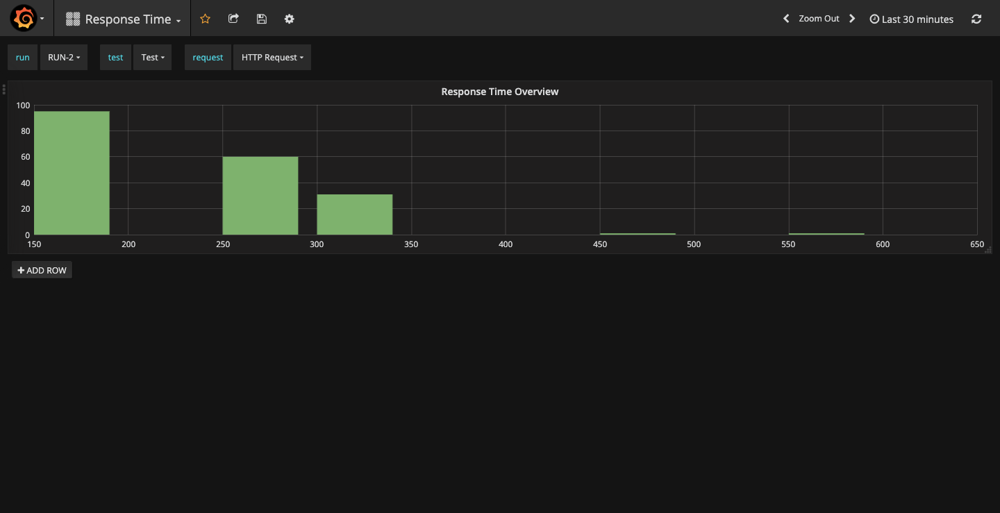
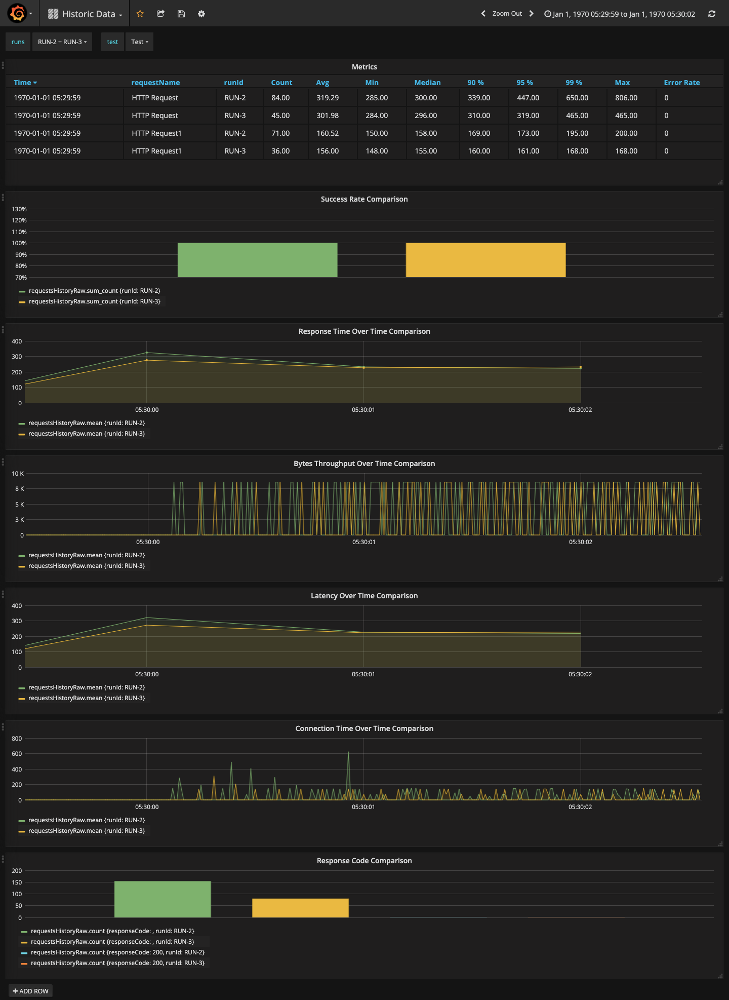

# JMeter-InfluxDB-Writer
Plugin for JMeter that allows to write load test data on-the-fly to influxDB.

# How to use this plugin

 - For using this plugin we need to have InfluxDB and Grafana up and running. The easiest way to spin up is by using Docker.
 Refer [here]( https://www.blazemeter.com/blog/how-to-create-a-lightweight-performance-monitoring-solution-with-docker-grafana-and-influxdb/) which gives detailed description of how to spawn Grafana and InfluxDB using docker. 
 > Once the command executed successfully we will have following thigs done.

    - Influx db is spawned 
    - Database with name "influx" is created with username and password as "admin"/"admin"
    - Grafana is spawned. you can access it from http://localhost:3000 (username/password : admin/admin)
    - InfluxDB as data source is added to Grafana.
 
 
 - Download the [JMeter-InfluxDB-Writer](https://github.com/sfakrudeen78/JMeter-InfluxDB-Writer/releases/download/v-1.2.2/JMeter-InfluxDB-Writer-plugin-1.2.2.jar) plugin.
 
 - Place the jar in JMETER_HOME/lib/ext directory and start the Jmeter.
 
 - Once the JMeter is restarted, you can create a new test or reuse an existing test and add Backend Listener to it. To do so go to Test Plan > Add > Listener > Backend Listener
 
 
 - In the backend listener select rocks.nt.apm.jmeter.JmeterInfluxDBBackendListenerClient
 
 
 - Add or mofify value of parameters especially dbname, dbusername, dbpassword.
 
 - To make sure things are working fine, you can run a test and refer **Jmeter Logs (Log Viewer )**.
 > You will see the following logs without any error:
 '''2019-09-13 08:49:52,043 INFO o.a.j.v.b.BackendListener: Backend Listener: Starting worker with class: class rocks.nt.apm.jmeter.JMeterInfluxDBBackendListenerClient and queue capacity: 5000
2019-09-13 08:49:52,043 INFO o.a.j.v.b.BackendListener: Backend Listener: Started  worker with class: class rocks.nt.apm.jmeter.JMeterInfluxDBBackendListenerClient
 2019-09-13 08:49:53,798 INFO r.n.a.j.JMeterInfluxDBBackendListenerClient: Shutting down influxDB scheduler...
 2019-09-13 08:49:53,858 INFO r.n.a.j.JMeterInfluxDBBackendListenerClient: influxDB scheduler terminated!'''
 
 
 
# Configure Grafana to view the collected metrics

The following things need to done to configure Grafana to view the collected metrics from Influx db.
* Download the following dashboard files and import all the dashboard in Grafana. For more information on how to import dashboard in Grafana refer [here](https://grafana.com/docs/reference/export_import/#importing-a-dashboard).
  * [Main Dashboard](MainDashboard.json)
  * [Response Time Dashboard](ResponseTime.json)
  * [Historic Data Dashboard](HistoricData.json)
* To know how the dashboard look like refer to the following url:
  * [Main Dashboard](https://snapshot.raintank.io/dashboard/snapshot/4wgKQWo7g3MkbieYm1VJLJEQey0r2AON)
  * [Response Time Dashboard](https://snapshot.raintank.io/dashboard/snapshot/6kVtxW54KwbhQjIRY31YBY306OyZuauo)
  * [Historic Data Dashboard](https://snapshot.raintank.io/dashboard/snapshot/Qw3oF4rUvaQVRwLgGHYRr84FP3zhgtnx)
* Dashboard Images for reference:
  * 
  * 
  *  
 
 
 
 
